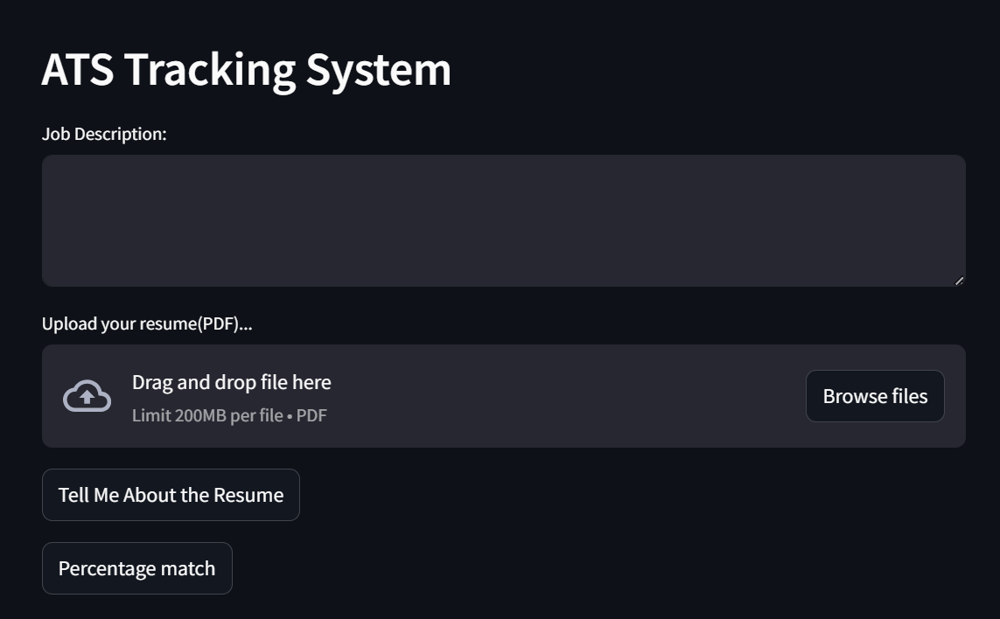

# End-to-End Resume Application Tracking System (ATS)

This project implements an advanced Applicant Tracking System (ATS) that streamlines the recruitment process by integrating with Google's Gemini Pro. It offers functionalities such as resume parsing, keyword matching, and candidate evaluation to enhance talent acquisition efficiency.

## Overview

The system evaluates resumes against job descriptions, providing insights like match percentage, missing keywords, and profile summaries. By leveraging large language models, it aims to optimize the recruitment workflow.

## Features

- **Job Description Match:** Assesses how well a candidate's resume aligns with the job description.
- **Missing Keywords Identification:** Highlights essential keywords absent from the resume.
- **Profile Summary:** Generates a concise summary of the candidate's qualifications and suitability.

## Requirements

- Python 3.10
- Gemini Pro API key

## Installation

1. **Clone the repository:**
   ```bash
   git clone https://github.com/veydantkatyal/ats-resume-tracker-gemini.git
   cd ats-resume-tracker-gemini
   ```
2. **Install dependencies**
   ```bash
   pip install -r requirements.txt
   ```   
3. Set up Gemini Pro API credentials:
- Obtain API credentials from the MakerSuite platform.
- Create a `.env` file in the project root directory with the following content:
  ```bash
  GOOGLE_API_KEY=your_api_key
  ```
## Usage
1. Run the application:
```bash
streamlit run app.py
```
2. Access the application: Open your web browser and navigate to `http://localhost:8501.`

3. Analyze resumes:
- Input the job description and upload the candidate's resume.
- Submit to receive analysis including match percentage, missing keywords, and a profile summary.

## Web App Design

## License
This project is licensed under the [MIT License](https://github.com/veydantkatyal/ats-resume-tracker-gemini/blob/main/LICENSE).
